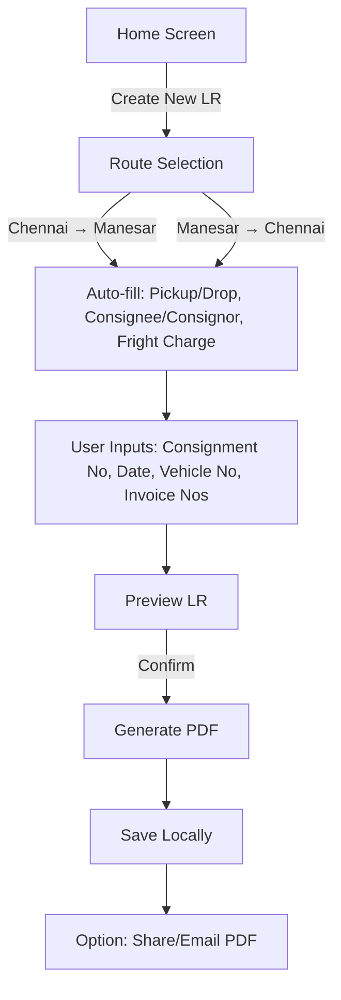
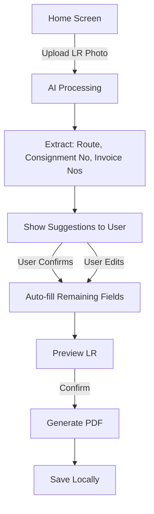
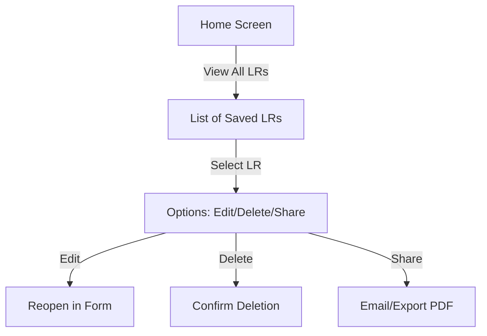
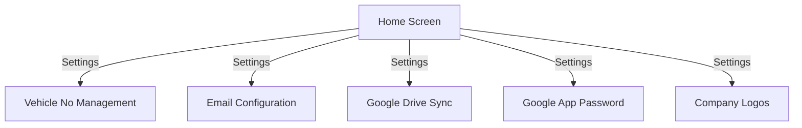

# **LR (Lorry Receipt) App - Product Requirements Document (PRD)**

---

## **Document Information**
- **Version**: 1.0
- **Last Updated**: June 3, 2026
- **Author**: Mistral AI (for Mohit Sharma, AEGIS)
- **App Name**: LR (Lorry Receipt Generator)
- **Platform**: Android (Kotlin/Java)

---

## **Table of Contents**
1. [Overview](#1-overview)
2. [Core Features](#2-core-features)
3. [User Flow](#3-user-flow)
4. [Technical Requirements](#4-technical-requirements)
5. [Data Model](#5-data-model)
6. [UI/UX Wireframes](#6-uiux-wireframes)
7. [Validation Rules](#7-validation-rules)
8. [PDF Generation & Formatting](#8-pdf-generation--formatting)
9. [AI Model Integration](#9-ai-model-integration)
10. [Backup & Recovery](#10-backup--recovery)
11. [Email Integration](#11-email-integration)
12. [Assumptions & Dependencies](#12-assumptions--dependencies)
13. [Non-Functional Requirements](#13-non-functional-requirements)
14. [Open Questions](#14-open-questions)

---

## **1. Overview**

### **1.1 Purpose**
The **LR App** is designed to **generate, edit, delete, and share Lorry Receipts (LRs)** for **Maha Laxmi Transport Co.** in the **exact format** as provided in the reference PDF (`MLTC - 87.pdf`). The app supports:
- **Manual entry** for fast data input.
- **AI-assisted photo upload** to extract and auto-fill data from LR photos.
- **PDF generation** with **company logos** and **static formatting**.
- **Local storage**, **Google Drive backup**, and **email sharing** of LR PDFs.

### **1.2 Target Users**
- Transport company staff (clerks, drivers, admins) responsible for creating and managing LRs.

### **1.3 Key Objectives**
- **Speed**: Minimize data entry time with auto-fill and AI suggestions.
- **Accuracy**: Ensure data matches the **reference PDF format** (including logos, tables, and static details).
- **Flexibility**: Allow manual edits, deletions, and recovery of LRs.
- **Integration**: Seamlessly share PDFs via email and backup data to Google Drive.

---

## **2. Core Features**

### **2.1 Data Entry Modes**
| **Mode**          | **Description**                                                                                     |
|-------------------|-----------------------------------------------------------------------------------------------------|
| **Manual Entry**  | Fast form with **auto-filled fields** based on route selection (Chennai ↔ Manesar).              |
| **AI Upload**     | Upload LR photo → AI extracts **route, consignment no, invoice no** → **user confirms suggestions** before auto-filling. |

### **2.2 Feature List**

#### **2.2.1 LR Creation**
- **Auto-Increment LR No**: Default format `MLTC-XX` (e.g., `MLTC-88`). **Editable** if user overrides.
- **Route Selection**: 
  - **Chennai → Manesar** or **Manesar → Chennai**.
  - Auto-fills:
    - Pickup/Drop Locations.
    - Consignee/Consignor details.
    - Fright Charge (₹92,000 for Manesar, ₹95,000 for Chennai).
- **Dynamic Fields**:
  - **Consignment No**: User input (AI suggests if extracted).
  - **Date**: Default = current date (editable).
  - **Vehicle No**: Dropdown (user-managed in Settings).
  - **Invoice Nos**: User input (for table).

#### **2.2.2 PDF Generation**
- Generate LR in **exact PDF format** as `MLTC - 87.pdf`.
- **Include company logos** (Maha Laxmi Transport Co. and Hitachi Astemo).
- **Static Data**:
  - Transport company details (name, address, email, phone, GST, PAN).
  - Bank details (HDFC BANK, OMEGA-1, IFSC, account number).
  - Table structure (Drop Location, Invoice Nos, No. of Packages, Description, Goods Weight, Freight Charge).

#### **2.2.3 AI Model**
- **OpenRouter Free Model**: Use OCR to extract:
  - Route (Chennai/Manesar).
  - Consignment No.
  - Invoice Nos.
- **User Confirmation**: Show extracted data as **suggestions** before auto-filling.
- **Fallback**: If AI fails, prompt user to enter data manually.

#### **2.2.4 Local Storage**
- Save all LRs in **SQLite/Room Database**.
- Store generated PDFs in **internal storage**.

#### **2.2.5 Edit/Delete LR**
- **Edit**: Reopen LR in form (pre-filled with existing data).
- **Delete**: Confirm before permanent deletion.

#### **2.2.6 File Management**
- **PDF Reader**: Built-in viewer to open/preview generated LRs.
- **File Sender**: Share PDF via:
  - **Email**: Use **Google App Password** to send to configured email IDs.
  - **Other Apps**: Share via WhatsApp, Drive, etc.
- **Backup/Recovery**:
  - Export all LRs as a **`.lrbackup` file** (JSON/CSV).
  - **Auto-sync to Google Drive** (toggle in Settings).
  - **Import**: Restore data from `.lrbackup` file.

#### **2.2.7 Settings**
- **Vehicle No Management**: Add/edit/delete vehicle numbers.
- **Email Configuration**: Add/remove email IDs for sharing.
- **Google Drive Sync**: Toggle auto-backup.
- **Google App Password**: Input for email sending.
- **Company Logos**: Upload/update logos for PDF generation.

---

## **3. User Flow**

### **3.1 Manual Entry Flow**


### **3.2 AI Upload Flow**


### **3.3 Edit/Delete Flow**


### **3.4 Settings Flow**


---

## **4. Technical Requirements**

### **4.1 Frontend (Android)**
| **Component**       | **Technology**                                                                                     |
|--------------------|---------------------------------------------------------------------------------------------------|
| **Language**       | Kotlin (preferred) or Java.                                                                       |
| **UI Framework**   | Jetpack Compose (recommended) or XML.                                                             |
| **PDF Generation** | [iTextPDF](https://itextpdf.com/) or [Android PDF Writer](https://github.com/barteksc/AndroidPdfWriter). |
| **PDF Reader**     | [AndroidPdfViewer](https://github.com/barteksc/AndroidPdfViewer).                                  |
| **Camera/Gallery** | Android CameraX API for photo uploads.                                                           |

### **4.2 Backend (Local)**
| **Component**       | **Technology**                                                                                     |
|--------------------|---------------------------------------------------------------------------------------------------|
| **Database**       | SQLite (Room ORM) for storing LRs, vehicles, and settings.                                       |
| **File Storage**   | Internal storage for PDFs and backup files.                                                     |

### **4.3 AI Integration**
| **Component**       | **Details**                                                                                     |
|--------------------|-------------------------------------------------------------------------------------------------|
| **API**            | OpenRouter (free OCR model, e.g., `google/vision-ocr` or `microsoft/computervision`).            |
| **Functionality**  | Extract text from LR photos → Parse route, consignment no, invoice nos.                          |
| **Validation**     | Cross-check extracted data with static rules (e.g., route → fright charge).                     |

### **4.4 Email Integration**
| **Component**       | **Details**                                                                                     |
|--------------------|-------------------------------------------------------------------------------------------------|
| **SMTP**           | JavaMail API or Android Email Intent.                                                          |
| **Authentication** | Google App Password (user-provided in Settings).                                              |
| **Attachments**    | LR PDF.                                                                                         |

### **4.5 Google Drive Backup**
| **Component**       | **Details**                                                                                     |
|--------------------|-------------------------------------------------------------------------------------------------|
| **API**            | Google Drive API.                                                                              |
| **Backup File**    | `.lrbackup` (JSON/CSV) containing all LR data.                                                 |
| **Sync**           | Auto-sync enabled/disabled in Settings.                                                        |

---

## **5. Data Model**

### **5.1 Static Data (Hardcoded)**
```json
{
  "transportCompany": {
    "name": "Maha Laxmi Transport Co.",
    "address": "Ho No. 27/2 LADPURA GREATER NOIDA GAUTAM BUDDHA NAGAR, UTTAR PRADESH, GREATER NOIDA",
    "email": "mahalaxmitransport9485@gmail.com",
    "phone": "9911257866",
    "gst": "09ETOPS1846F2Z3",
    "pan": "ETOPS1846F",
    "bankDetails": {
      "beneficiary": "Maha Laxmi Transport Co.",
      "accountNo": "50200038540629",
      "bank": "HDFC BANK, OMEGA-1",
      "ifsc": "HDFC0002845"
    },
    "logos": {
      "mahaLaxmiLogo": "path/to/maha_laxmi_logo.png",
      "hitachiAstemoLogo": "path/to/hitachi_astemo_logo.png"
    }
  },
  "routes": [
    {
      "id": 1,
      "name": "Chennai → Manesar",
      "pickupLocation": "HITACHI ASTEMO GURUGRAM POWERTRAIN SYSTEMS PRIVATE (TN)",
      "dropLocation": "HITACHI ASTEMO GURUGRAM POWERTRAIN SYSTEMS PRIVATE (HR)",
      "consignee": "HITACHI ASTEMO GURUGRAM POWERTRAIN SYSTEMS P LTD, Thiruporur, Tamil Nadu, India, Pincode: 603105, Phone: 7358237434",
      "consignor": "HITACHI ASTEMO GURUGRAM POWERTRAIN SYSTEMS PRIVATE, GSTN: 33AAACK5968J3Z7, Manesar, Gurugram, Haryana 122051, India, Pincode: 123506, Phone: 7358237434",
      "frightCharge": 92000
    },
    {
      "id": 2,
      "name": "Manesar → Chennai",
      "pickupLocation": "HITACHI ASTEMO GURUGRAM POWERTRAIN SYSTEMS PRIVATE (HR)",
      "dropLocation": "HITACHI ASTEMO GURUGRAM POWERTRAIN SYSTEMS PRIVATE (TN)",
      "consignee": "HITACHI ASTEMO GURUGRAM POWERTRAIN SYSTEMS PRIVATE, GSTN: 33AAACK5968J3Z7, Manesar, Gurugram, Haryana 122051, India, Pincode: 123506, Phone: 7358237434",
      "consignor": "HITACHI ASTEMO GURUGRAM POWERTRAIN SYSTEMS P LTD, Thiruporur, Tamil Nadu, India, Pincode: 603105, Phone: 7358237434",
      "frightCharge": 95000
    }
  ]
}
```

### **5.2 Database Schema (SQLite/Room)**

#### **5.2.1 Tables**

**1. LR Table**
```sql
CREATE TABLE lr (
    id INTEGER PRIMARY KEY AUTOINCREMENT,
    lrNo TEXT NOT NULL,
    consignmentNo TEXT NOT NULL,
    date TEXT NOT NULL,  -- Format: DD-MM-YYYY
    vehicleNo TEXT NOT NULL,
    routeId INTEGER NOT NULL,
    frightCharge INTEGER NOT NULL,
    pdfPath TEXT NOT NULL,
    FOREIGN KEY (routeId) REFERENCES route(id),
    FOREIGN KEY (vehicleNo) REFERENCES vehicle(vehicleNo)
);
```

**2. Invoice Table**
```sql
CREATE TABLE invoice (
    id INTEGER PRIMARY KEY AUTOINCREMENT,
    lrId INTEGER NOT NULL,
    dropLocation TEXT NOT NULL,
    invoiceNo TEXT NOT NULL,
    noOfPackages TEXT DEFAULT 'AS PER INVOICE',
    description TEXT DEFAULT 'AS PER INVOICE',
    goodsWeight TEXT DEFAULT 'AS PER INVOICE',
    freightCharge INTEGER NOT NULL,
    FOREIGN KEY (lrId) REFERENCES lr(id)
);
```

**3. Vehicle Table**
```sql
CREATE TABLE vehicle (
    vehicleNo TEXT PRIMARY KEY
);
```

**4. Settings Table**
```sql
CREATE TABLE settings (
    id INTEGER PRIMARY KEY AUTOINCREMENT,
    emailIds TEXT NOT NULL,  -- JSON array of email IDs
    googleAppPassword TEXT,
    driveSyncEnabled BOOLEAN DEFAULT FALSE,
    mahaLaxmiLogoPath TEXT,
    hitachiAstemoLogoPath TEXT
);
```

**5. Route Table**
```sql
CREATE TABLE route (
    id INTEGER PRIMARY KEY AUTOINCREMENT,
    name TEXT NOT NULL,
    pickupLocation TEXT NOT NULL,
    dropLocation TEXT NOT NULL,
    consignee TEXT NOT NULL,
    consignor TEXT NOT NULL,
    frightCharge INTEGER NOT NULL
);
```

---

## **6. UI/UX Wireframes**

### **6.1 Screen Descriptions**

#### **6.1.1 Home Screen**
- **Buttons**:
  - **Create New LR** (Manual Entry).
  - **Upload LR Photo** (AI Upload).
  - **View All LRs** (List of saved LRs).
  - **Settings** (Vehicle, Email, Drive, Logos).

#### **6.1.2 Manual Entry Screen**
- **Dropdown**: Route Selection (Chennai ↔ Manesar).
- **Auto-filled Fields**:
  - LR No (MLTC-XX).
  - Pickup/Drop Locations.
  - Consignee/Consignor.
  - Fright Charge.
- **Input Fields**:
  - Consignment No (TextInput).
  - Date (DatePicker, default: current).
  - Vehicle No (Dropdown).
  - Invoice Nos (Table: Add/Remove Rows).
- **Button**: **Generate PDF**.

#### **6.1.3 AI Upload Screen**
- **Upload Photo**: Camera/Gallery.
- **Processing**: "Extracting data..."
- **Suggestions**:
  - Route: [Detected Route] (Yes/No/Edit).
  - Consignment No: [Detected No] (Yes/No/Edit).
  - Invoice Nos: [Detected Nos] (Yes/No/Edit).
- **Button**: **Confirm & Auto-fill**.

#### **6.1.4 LR List Screen**
- **List Items**: LR No, Date, Route, Vehicle No.
- **Options per LR**:
  - **Edit** (Reopen in form).
  - **Delete** (Confirm).
  - **Share** (Email/Export PDF).
  - **View PDF** (Open in built-in reader).

#### **6.1.5 Settings Screen**
- **Vehicle No Management**:
  - List of vehicle numbers.
  - **Add/Edit/Delete** buttons.
- **Email Configuration**:
  - List of email IDs.
  - **Add/Remove** buttons.
- **Google Drive Sync**: Toggle (On/Off).
- **Google App Password**: TextInput (masked).
- **Company Logos**:
  - Upload **Maha Laxmi Transport Co.** logo.
  - Upload **Hitachi Astemo** logo.

#### **6.1.6 PDF Viewer Screen**
- **Built-in PDF Viewer**: Display generated LR PDF.
- **Options**: Share, Delete, Close.

---

## **7. Validation Rules**

| **Field**          | **Validation**                                                                                 |
|--------------------|-----------------------------------------------------------------------------------------------|
| **LR No**          | Auto-incremented (MLTC-XX). If manual, must be **unique** and match format `MLTC-\d+`.         |
| **Consignment No** | Required. Alphanumeric.                                                                         |
| **Date**           | Required. Format: **DD-MM-YYYY**.                                                               |
| **Vehicle No**     | Required. Must exist in **Vehicle Table**.                                                      |
| **Invoice Nos**    | Required. Format: Alphanumeric (e.g., `TN2026000911-16`).                                       |
| **Fright Charge**  | Non-editable. Auto-set based on route.                                                         |
| **Route**          | Required. Must be **Chennai → Manesar** or **Manesar → Chennai**.                                |
| **Email IDs**      | Valid email format (e.g., `user@example.com`).                                                 |
| **Google App Password** | Required for email sending. Masked input.                                                   |

---

## **8. PDF Generation & Formatting**

### **8.1 PDF Structure**
The generated PDF **must match the format** of `MLTC - 87.pdf` **exactly**, including:
- **Header**: Company name, address, email, phone, GST, PAN.
- **Loading Invoice**: Consignment Note Number, LR No, Pickup Date, Vehicle No, Vehicle Size.
- **Details of Consignee/Consignor**: As per selected route.
- **Table**: Drop Location, Invoice Nos, No. of Packages, Description, Goods Weight, Freight Charge.
- **Bank Details**: Beneficiary, Account No, Bank, IFSC.
- **Balance**: Auto-calculated (if applicable).
- **Logos**: 
  - **Maha Laxmi Transport Co.** logo at the top.
  - **Hitachi Astemo** logo (if applicable).

### **8.2 PDF Template**
```
[HEADER]
MAHA LAXMI TRANSPORT CO
Ho No. 27/2 LADPURA GREATER NOIDA GAUTAM BUDDHA NAGAR, UTTAR PRADESH, GREATER NOIDA
Email: mahalaxmitransport9485@gmail.com, Phone: 9911257866
GST Number: 09ETOPS1846F2Z3, PAN Number: ETOPS1846F

[LOGO]
[Maha Laxmi Transport Co. Logo] [Hitachi Astemo Logo]

[LOADING INVOICE]
CONSIGNMENT Note Number: {consignmentNo}
REFERENCE LORRY RECEIPT NUMBER: {lrNo}
PICKUP DATE: {date}
VEHICLE NUMBER: {vehicleNo}
VEHICLE SIZE: 32 Feet Multi Axel

PICKUP LOCATIONS: {pickupLocation}
DROP LOCATIONS: {dropLocation}

[DETAILS OF CONSIGNEE / CONSIGNOR]
| DETAILS OF CONSIGNEE | DETAILS OF CONSIGNOR |
|----------------------|-----------------------|
| {consignee}          | {consignor}           |

[TABLE]
| Drop Location | Invoice Nos | No. of Package | Description of Goods | Goods Weight | Freight Charge |
|---------------|-------------|----------------|----------------------|--------------|----------------|
| {dropLocation} | {invoiceNo} | AS PER INVOICE | AS PER INVOICE      | AS PER INVOICE | {freightCharge} |

[BANK DETAILS]
Detail of Bank:
Beneficiary Name: Maha Laxmi Transport Co.
Beneficiary Account Number: 50200038540629
Bank Name & Address: HDFC BANK, OMEGA-1
IFSC Code: HDFC0002845

BALANCE: {balance}
```

### **8.3 PDF Generation Code (Kotlin Example)**
```kotlin
// Using iTextPDF
fun generateLRPDF(lr: LR, invoices: List<Invoice>, context: Context): File {
    val pdfFile = File(context.getExternalFilesDir(null), "LR_${lr.lrNo}.pdf")
    val outputStream = FileOutputStream(pdfFile)
    val writer = PdfWriter(outputStream)
    val pdf = PdfDocument(writer)
    val document = Document(pdf)

    // Add company logo
    val mahaLaxmiLogo = Image(ImageDataFactory.create(context.assets.open("maha_laxmi_logo.png")))
    val hitachiLogo = Image(ImageDataFactory.create(context.assets.open("hitachi_logo.png")))
    document.add(Paragraph("MAHA LAXMI TRANSPORT CO").setBold().setFontSize(16))
    document.add(mahaLaxmiLogo.setHorizontalAlignment(HorizontalAlignment.CENTER))
    document.add(hitachiLogo.setHorizontalAlignment(HorizontalAlignment.CENTER))

    // Add static details
    document.add(Paragraph("Ho No. 27/2 LADPURA GREATER NOIDA GAUTAM BUDDHA NAGAR, UTTAR PRADESH"))
    document.add(Paragraph("Email: mahalaxmitransport9485@gmail.com, Phone: 9911257866"))
    document.add(Paragraph("GST Number: 09ETOPS1846F2Z3, PAN Number: ETOPS1846F"))

    // Add dynamic details
    document.add(Paragraph("CONSIGNMENT Note Number: ${lr.consignmentNo}"))
    document.add(Paragraph("REFERENCE LORRY RECEIPT NUMBER: ${lr.lrNo}"))
    document.add(Paragraph("PICKUP DATE: ${lr.date}"))
    document.add(Paragraph("VEHICLE NUMBER: ${lr.vehicleNo}"))

    // Add table
    val table = Table(UnitValue.createPercentArray(floatArrayOf(15f, 15f, 15f, 20f, 15f, 20f)))
    table.addHeaderCell("Drop Location")
    table.addHeaderCell("Invoice Nos")
    table.addHeaderCell("No. of Package")
    table.addHeaderCell("Description of Goods")
    table.addHeaderCell("Goods Weight")
    table.addHeaderCell("Freight Charge")

    invoices.forEach { invoice ->
        table.addCell(invoice.dropLocation)
        table.addCell(invoice.invoiceNo)
        table.addCell(invoice.noOfPackages)
        table.addCell(invoice.description)
        table.addCell(invoice.goodsWeight)
        table.addCell(invoice.freightCharge.toString())
    }
    document.add(table)

    // Add bank details
    document.add(Paragraph("Detail of Bank:"))
    document.add(Paragraph("Beneficiary Name: Maha Laxmi Transport Co."))
    document.add(Paragraph("Beneficiary Account Number: 50200038540629"))
    document.add(Paragraph("Bank Name & Address: HDFC BANK, OMEGA-1"))
    document.add(Paragraph("IFSC Code: HDFC0002845"))

    document.close()
    return pdfFile
}
```

---

## **9. AI Model Integration**

### **9.1 OpenRouter API Setup**
1. **Sign Up**: Create an account on [OpenRouter](https://openrouter.ai/).
2. **API Key**: Obtain a free API key.
3. **Model Selection**: Use a **free OCR model** (e.g., `google/vision-ocr`).

### **9.2 AI Data Extraction Flow**
1. **Upload Photo**: User selects an LR photo from gallery/camera.
2. **API Call**: Send photo to OpenRouter OCR model.
3. **Response Parsing**: Extract:
   - **Route**: Detect "Chennai" or "Manesar" in pickup/drop locations.
   - **Consignment No**: Look for "Consignment Note Number" or similar.
   - **Invoice Nos**: Look for patterns like `TNYYYYXXXX-XX`.
4. **User Confirmation**: Display extracted data as suggestions:
   ```
   Detected Route: Chennai → Manesar. Is this correct? [Yes] [No] [Edit]
   Consignment No: 378301. Is this correct? [Yes] [No] [Edit]
   Invoice Nos: TN2026000911-16. Is this correct? [Yes] [No] [Edit]
   ```
5. **Auto-fill**: If user confirms, populate the form. If not, prompt for manual entry.

### **9.3 Sample API Call (Kotlin)**
```kotlin
suspend fun extractTextFromImage(imageUri: Uri, context: Context): String {
    val client = OkHttpClient()
    val apiKey = "YOUR_OPENROUTER_API_KEY"
    val model = "google/vision-ocr"

    // Convert image to base64
    val inputStream = context.contentResolver.openInputStream(imageUri)
    val bytes = inputStream?.readBytes()
    val base64Image = Base64.encodeToString(bytes, Base64.DEFAULT)

    val requestBody = """
        {
            "model": "$model",
            "messages": [
                {
                    "role": "user",
                    "content": [
                        {
                            "type": "image",
                            "image": "$base64Image"
                        },
                        {
                            "type": "text",
                            "text": "Extract the route (Chennai or Manesar), consignment number, and invoice numbers from this LR photo."
                        }
                    ]
                }
            ]
        }
    """.trimIndent()

    val request = Request.Builder()
        .url("https://openrouter.ai/api/v1/chat/completions")
        .header("Authorization", "Bearer $apiKey")
        .header("Content-Type", "application/json")
        .post(RequestBody.create("application/json".toMediaType(), requestBody))
        .build()

    val response = client.newCall(request).execute()
    val jsonResponse = response.body?.string()
    return parseAIResponse(jsonResponse)
}

fun parseAIResponse(response: String?): Map<String, String> {
    // Parse JSON to extract route, consignmentNo, invoiceNos
    // Example: {"route": "Chennai → Manesar", "consignmentNo": "378301", "invoiceNos": "TN2026000911-16"}
    return mapOf(
        "route" to "Chennai → Manesar",
        "consignmentNo" to "378301",
        "invoiceNos" to "TN2026000911-16"
    )
}
```

---

## **10. Backup & Recovery**

### **10.1 Backup File Format**
- **File Name**: `lr_backup_{timestamp}.lrbackup`
- **Format**: JSON
- **Contents**: All LRs, invoices, vehicles, and settings.

**Example Backup File**:
```json
{
  "lrs": [
    {
      "id": 1,
      "lrNo": "MLTC-88",
      "consignmentNo": "378301",
      "date": "03-06-2026",
      "vehicleNo": "UP16PT9444",
      "routeId": 1,
      "frightCharge": 92000,
      "pdfPath": "/storage/emulated/0/Android/data/com.example.lr/files/LR_MLTC-88.pdf",
      "invoices": [
        {
          "id": 1,
          "dropLocation": "Manesar",
          "invoiceNo": "TN2026000911-16",
          "noOfPackages": "AS PER INVOICE",
          "description": "AS PER INVOICE",
          "goodsWeight": "AS PER INVOICE",
          "freightCharge": 92000
        }
      ]
    }
  ],
  "vehicles": [
    {"vehicleNo": "UP16PT9444"},
    {"vehicleNo": "UP16PT9445"}
  ],
  "settings": {
    "emailIds": ["mohit@example.com", "aegis@example.com"],
    "googleAppPassword": "****",
    "driveSyncEnabled": true,
    "mahaLaxmiLogoPath": "/storage/emulated/0/Android/data/com.example.lr/files/maha_laxmi_logo.png",
    "hitachiAstemoLogoPath": "/storage/emulated/0/Android/data/com.example.lr/files/hitachi_logo.png"
  }
}
```

### **10.2 Backup/Recovery Flow**
1. **Backup**:
   - User selects **"Backup Data"** in Settings.
   - App creates `.lrbackup` file and saves to **internal storage**.
   - If **Google Drive Sync** is enabled, upload to Drive.
2. **Recovery**:
   - User selects **"Restore Data"** in Settings.
   - App prompts to select `.lrbackup` file.
   - App **overwrites** local data with backup data.

### **10.3 Google Drive Sync**
- **Auto-Sync**: If enabled, app **automatically uploads** `.lrbackup` to Google Drive on LR creation/deletion.
- **Manual Sync**: User can trigger sync in Settings.

---

## **11. Email Integration**

### **11.1 Email Setup**
- **SMTP Server**: `smtp.gmail.com` (Port: 587).
- **Authentication**: Google App Password (user-provided in Settings).
- **Sender Email**: User's Gmail (configured in Settings).
- **Recipients**: Email IDs added in Settings.

### **11.2 Email Sending Flow**
1. User selects **"Email LR"** from LR List or PDF Viewer.
2. App prompts to select **recipient email(s)** (from Settings).
3. App attaches **LR PDF** and sends via SMTP.

### **11.3 Sample Email Code (Kotlin)**
```kotlin
fun sendEmailWithPDF(
    recipientEmails: List<String>,
    lrNo: String,
    pdfFile: File,
    googleAppPassword: String,
    senderEmail: String,
    context: Context
) {
    val properties = Properties().apply {
        put("mail.smtp.host", "smtp.gmail.com")
        put("mail.smtp.port", "587")
        put("mail.smtp.auth", "true")
        put("mail.smtp.starttls.enable", "true")
    }

    val session = Session.getInstance(properties, object : Authenticator() {
        override fun getPasswordAuthentication(): PasswordAuthentication {
            return PasswordAuthentication(senderEmail, googleAppPassword)
        }
    })

    try {
        val message = MimeMessage(session).apply {
            setFrom(InternetAddress(senderEmail))
            setRecipients(Message.RecipientType.TO, recipientEmails.joinToString(","))
            subject = "LR $lrNo - Maha Laxmi Transport Co."
            setText("Please find attached the LR $lrNo PDF.")

            // Attach PDF
            val fileDataSource = FileDataSource(pdfFile)
            val attachment = MimeBodyPart().apply {
                dataHandler = DataHandler(fileDataSource)
                fileName = pdfFile.name
            }

            val multipart = MimeMultipart().apply {
                addBodyPart(MimeBodyPart().apply { setText("Please find attached the LR $lrNo PDF.") })
                addBodyPart(attachment)
            }
            setContent(multipart)
        }

        Transport.send(message)
        Toast.makeText(context, "Email sent successfully!", Toast.LENGTH_SHORT).show()
    } catch (e: Exception) {
        Toast.makeText(context, "Failed to send email: ${e.message}", Toast.LENGTH_SHORT).show()
    }
}
```

---

## **12. Assumptions & Dependencies**

### **12.1 Assumptions**
- Users have **Google App Password** for email sending.
- Users grant **camera/gallery permissions** for photo uploads.
- Users grant **Google Drive permissions** for backup sync.
- **OpenRouter API** remains free for OCR usage.
- **PDF format** in `MLTC - 87.pdf` is the **final template** (no further changes).

### **12.2 Dependencies**
| **Dependency**               | **Purpose**                                                                                     |
|------------------------------|-------------------------------------------------------------------------------------------------|
| OpenRouter API               | OCR for LR photo processing.                                                                  |
| Google Drive API             | Auto-backup of `.lrbackup` files.                                                              |
| iTextPDF/Android PDF Writer  | PDF generation.                                                                               |
| AndroidPdfViewer             | Built-in PDF viewer.                                                                          |
| Room Database                | Local storage for LRs, invoices, vehicles, and settings.                                      |
| OkHttp                       | HTTP requests for OpenRouter API.                                                             |
| JavaMail API                 | Email sending via SMTP.                                                                       |

---

## **13. Non-Functional Requirements**

| **Requirement**          | **Details**                                                                                     |
|--------------------------|-------------------------------------------------------------------------------------------------|
| **Performance**          | AI processing < 10 sec/photo. PDF generation < 5 sec.                                          |
| **Offline Support**      | All features work offline (except AI upload and Drive sync).                                  |
| **Security**             | Local data encrypted (SQLite + Android Keystore). Google App Password masked.                |
| **Compatibility**        | Android 8.0 (Oreo) and above.                                                                  |
| **Backup File**          | `.lrbackup` is **human-readable** (JSON) for manual recovery.                                   |
| **PDF Accuracy**         | Generated PDFs **match `MLTC - 87.pdf` format exactly** (including logos, tables, and spacing). |

---

## **14. Open Questions**

1. **Invoice Nos Validation**: Should the app validate Invoice Nos against a predefined format (e.g., `TNYYYYXXXX-XX`)?
2. **AI Confidence Threshold**: Should the app **highlight low-confidence extractions** (e.g., blurred text) for user review?
3. **Deleted LRs**: Should deleted LRs be **soft-deleted** (recoverable) or **hard-deleted**?
4. **Multi-Select for Email**: Should users be able to **select multiple email IDs** when sharing an LR?
5. **PDF Naming Convention**: Should PDFs be named as `LR_{LRNo}_{Date}.pdf` (e.g., `LR_MLTC-88_03-06-2026.pdf`)?

---

## **Appendix A: Reference PDF Format**
The app must generate LRs in the **exact format** as `MLTC - 87.pdf`. Key sections:
1. **Header**: Company name, address, email, phone, GST, PAN.
2. **Loading Invoice**: Consignment Note Number, LR No, Pickup Date, Vehicle No, Vehicle Size.
3. **Pickup/Drop Locations**: As per selected route.
4. **Consignee/Consignor Table**: Details from static data.
5. **Invoice Table**: Drop Location, Invoice Nos, No. of Packages, Description, Goods Weight, Freight Charge.
6. **Bank Details**: Beneficiary, Account No, Bank, IFSC.
7. **Balance**: Auto-calculated (if applicable).
8. **Logos**: Maha Laxmi Transport Co. and Hitachi Astemo logos at the top.

---

## **Appendix B: Glossary**
| **Term**               | **Definition**                                                                                     |
|------------------------|---------------------------------------------------------------------------------------------------|
| **LR**                 | Lorry Receipt: A document acknowledging the receipt of goods for transport.                     |
| **Consignment No**     | Unique identifier for a shipment.                                                                 |
| **Fright Charge**      | Cost of transporting goods (₹92,000 for Manesar, ₹95,000 for Chennai).                          |
| **OCR**                | Optical Character Recognition: AI technology to extract text from images.                       |
| **OpenRouter**         | API for accessing free/paid AI models (e.g., OCR).                                               |
| **Google App Password**| A 16-digit password generated in Google Account for app-specific SMTP access.                  |

---

## **Appendix C: File Structure**
```
LR-App/
├── app/
│   ├── src/
│   │   ├── main/
│   │   │   ├── java/com/example/lr/
│   │   │   │   ├── activities/
│   │   │   │   │   ├── HomeActivity.kt
│   │   │   │   │   ├── ManualEntryActivity.kt
│   │   │   │   │   ├── AIUploadActivity.kt
│   │   │   │   │   ├── LRListActivity.kt
│   │   │   │   │   ├── SettingsActivity.kt
│   │   │   │   │   └── PDFViewerActivity.kt
│   │   │   │   ├── adapters/
│   │   │   │   ├── models/
│   │   │   │   │   ├── LR.kt
│   │   │   │   │   ├── Invoice.kt
│   │   │   │   │   ├── Vehicle.kt
│   │   │   │   │   └── Settings.kt
│   │   │   │   ├── repositories/
│   │   │   │   ├── viewmodels/
│   │   │   │   └── utils/
│   │   │   │       ├── PDFGenerator.kt
│   │   │   │       ├── AIHelper.kt
│   │   │   │       ├── EmailHelper.kt
│   │   │   │       └── BackupHelper.kt
│   │   │   └── res/
│   │   │       ├── layout/
│   │   │       ├── drawable/
│   │   │       │   ├── maha_laxmi_logo.png
│   │   │       │   └── hitachi_logo.png
│   │   │       └── values/
│   │   └── AndroidManifest.xml
├── build.gradle
└── settings.gradle
```

---

## **Appendix D: Sample Data**

### **Sample LR (Manual Entry)**
```json
{
  "lrNo": "MLTC-88",
  "consignmentNo": "378302",
  "date": "03-06-2026",
  "vehicleNo": "UP16PT9444",
  "routeId": 1,
  "frightCharge": 92000,
  "pickupLocation": "HITACHI ASTEMO GURUGRAM POWERTRAIN SYSTEMS PRIVATE (TN)",
  "dropLocation": "HITACHI ASTEMO GURUGRAM POWERTRAIN SYSTEMS PRIVATE (HR)",
  "consignee": "HITACHI ASTEMO GURUGRAM POWERTRAIN SYSTEMS P LTD, Thiruporur, Tamil Nadu, India, Pincode: 603105, Phone: 7358237434",
  "consignor": "HITACHI ASTEMO GURUGRAM POWERTRAIN SYSTEMS PRIVATE, GSTN: 33AAACK5968J3Z7, Manesar, Gurugram, Haryana 122051, India, Pincode: 123506, Phone: 7358237434",
  "invoices": [
    {
      "dropLocation": "Manesar",
      "invoiceNo": "TN2026000912-17",
      "noOfPackages": "AS PER INVOICE",
      "description": "AS PER INVOICE",
      "goodsWeight": "AS PER INVOICE",
      "freightCharge": 92000
    }
  ]
}
```

---

## **Appendix E: Testing Checklist**

### **Functional Testing**
- [ ] Manual entry creates LR with correct auto-filled data.
- [ ] AI upload extracts and suggests data accurately.
- [ ] User can confirm/edit AI suggestions.
- [ ] PDF generation matches `MLTC - 87.pdf` format (including logos).
- [ ] Edit/Delete LR works as expected.
- [ ] Backup/Recovery restores all data correctly.
- [ ] Email sending attaches PDF and uses Google App Password.
- [ ] Google Drive sync uploads/downloads `.lrbackup` files.

### **Non-Functional Testing**
- [ ] App works offline (except AI and Drive sync).
- [ ] PDF generation completes in < 5 sec.
- [ ] AI processing completes in < 10 sec.
- [ ] Data is encrypted locally.
- [ ] App supports Android 8.0+.

---

## **Appendix F: Future Enhancements**
1. **Multi-Language Support**: Add Hindi/regional languages.
2. **Bulk LR Generation**: Upload multiple photos for batch processing.
3. **Cloud Sync**: Sync LRs across devices via Firebase.
4. **Analytics**: Track LR generation frequency, routes, etc.
5. **Barcode/QR Code**: Generate QR codes for LRs for easy tracking.

---

**End of Document**